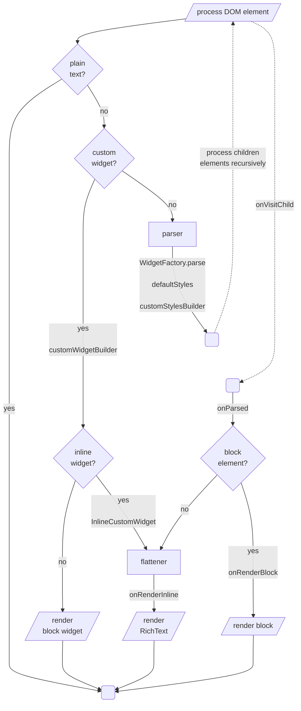

# Extensibility

The [flutter_widget_from_html](https://pub.dev/packages/flutter_widget_from_html) series of packages implement widget building logic with high testing coverage to ensure correctness. It tries to render an optimal tree by using `RichText` with specific `TextStyle`, merging text spans together, showing images in sized box, etc. The idea is to build a solid foundation for apps to customize.

There are two ways to alter the output widget tree.

1. Use callbacks like `customStylesBuilder` or `customWidgetBuilder` for small changes
2. Use a custom `WidgetFactory` for complete control of the rendering process

# Callbacks

## customStylesBuilder

For text style changes like color, italic, etc., use `customStylesBuilder` to specify inline styles (see supported list above) for each DOM element. Some common conditionals:

- If HTML tag is H1 `element.localName == 'h1'`
- If the element has `foo` CSS class `element.classes.contains('foo')`
- If an attribute has a specific value `element.attributes['x'] == 'y'`

This example changes the color for a CSS class:

<table><tr><td>

```dart
HtmlWidget(
  'Hello <span class="name">World</span>!',
  customStylesBuilder: (element) {
    if (element.classes.contains('name')) {
      return {'color': 'red'};
    }
    return null;
  },
),
```
  
[Try with fwfh.dev](https://try.fwfh.dev/?id=08173c5e5d837293837c383d00f9f792)

</td>
<td>
  
</td>
</tr>
</table>

## customWidgetBuilder

For fairly simple widget, use `customWidgetBuilder`. You will need to handle the DOM element and its children manually.

This example renders a carousel ([live demo](https://demo.fwfh.dev/#/customwidgetbuilder), [try with fwfh.dev](https://try.fwfh.dev/?id=657d84b28eb0352657400160c97d0f9d)):


# Custom factory

<table style="width: 100%"><tr><td style="width: 50%">

The HTML string is first parsed into DOM elements, and each element is traversed to construct the fwfh's build tree before being "flattened" into Flutter widgets. Central to this entire process is the `WidgetFactory` instance, which can be readily replaced with your own implementation.

```dart
class _MyWidgetFactory extends WidgetFactory {
  @override
  void parse(BuildTree tree) {
    // do something
    super.parse(tree);
  }
}

// somewhere in your app
HtmlWidget(
  'Hello <span class="name">World</span>!',
  factoryBuilder: () => _MyWidgetFactory(),
),
```

The most common integration point is `WidgetFactory.parse`, invoked individually for each element. Within this function, you have the option to adjust text styles using `BuildTree.inherit` or to register `BuildOp` for highly custom rendering.

</td><td style="width: 50%">



</td></tr></table>

## Inherited properties

You can modify inherited properties, including text styles, using the `inherit` function and registering your resolver callback to be invoked once the `BuildContext` is prepared. Here's how it works:

  - Your callback will be supplied with two parameters.
  - The first parameter is an immutable `InheritedProperties` object, calculated from the root to each element. To make changes, your callback must return a new `InheritedProperties` by calling `copyWith`. If no changes are required, it's recommended to return the same object.
  - Additionally, you can pass a dynamic value when you call `inherit`, and your callback will receive it as the second parameter during execution.

```dart
// simple resolver setting text color
tree.inherit(
  (resolving, _) => resolving.copyWith(
    style: resolving.style.copyWith(
      color: Colors.red,
    ),
  ),
);

// resolver uses the second param to set height
tree.inherit(
  (resolving, height) => resolving.copyWith(
    style: resolving.style.copyWith(
      height: height,
    ),
  ),
  2.0
);
```

Notes:
  - Use the `resolving.copyWith<Foo>(value: foo)` method to store various data types within the tree. Children elements can access this value through `resolved.get<Foo>()`.
  - Each element can enqueue as many resolver callbacks and set as many inherted properties as required.

## Build ops

Complex functionalities can be implemented using `BuildOp` or `BuildOp.inline`. Internally, all of the HTML tags are supported with the same architecture.  This means that by adopting this method, your potential for customization is virtually limitless. If you encounter any obstacles while trying to create custom rendering, please don't hesitate to open a GitHub enhancement issue.

```dart
tree.register(BuildOp(
  onParsed: (tree) {
    // can be used to change text, inline contents, etc.
    return tree..append(...);
  },
  onRenderBlock: (tree, child) {
    // use this to render special widget, wrap it into something else, etc.
    return MyCustomWidget(child: child);
  },
  // depending on the rendering logic, you may need to adjust the execution order to "jump the line"
  priority: 9999,
));
```

The example below replaces smilie inline image with an emoji:

<details>

<summary>smilie.dart</summary>

```dart
const kHtml = """
<p>Hello !</p>
<p>How are you ?
""";

const kSmilies = {':)': '🙂'};

class SmilieScreen extends StatelessWidget {
  @override
  Widget build(BuildContext context) => Scaffold(
        appBar: AppBar(
          title: Text('SmilieScreen'),
        ),
        body: Padding(
          padding: const EdgeInsets.all(8.0),
          child: HtmlWidget(
            kHtml,
            factoryBuilder: () => _SmiliesWidgetFactory(),
          ),
        ),
      );
}

class _SmiliesWidgetFactory extends WidgetFactory {
  final smilieOp = BuildOp(
    onParsed: (tree) {
      final alt = tree.element.attributes['alt'];
      return tree..addText(kSmilies[alt] ?? alt ?? '');
    },
  );

  @override
  void parse(BuildTree tree) {
    final e = tree.element;
    if (e.localName == 'img' &&
        e.classes.contains('smilie') &&
        e.attributes.containsKey('alt')) {
      tree.register(smilieOp);
      return;
    }

    return super.parse(tree);
  }
}
```

</details>


